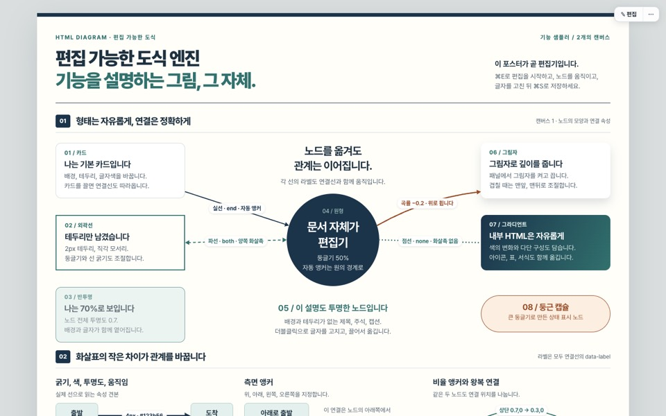

# html-diagram

편집 가능한 HTML 도식을 만드는 Claude Code 스킬입니다. **문서 자체가 에디터**입니다. 산출물은 외부 의존이 없는 HTML 한 파일이고, 보기 모드에서는 완전히 정적이며 편집 모드(⌘E)에서는 도형을 끌어 옮기고 글자를 고치고 같은 파일에 저장할 수 있습니다.

<p></p>

## 무엇을 해 주나

- **편집 모드**: 노드 드래그·리사이즈·복제(⌘D, ⌥드래그)·복사/잘라내기/붙여넣기(다른 문서로도)·삭제·생성, 화살표 끝점·곡률·라벨 편집, 속성 패널(색·테두리·둥글기·투명도·그림자·z순서), undo/redo(50단계).
- **저장**: 같은 파일 덮어쓰기(File System Access API, 크로미움), 직전 버전 히스토리 30개를 문서 안에 보관, 편집 0.7초 뒤 자동저장과 복구 배너. 미지원 브라우저는 다운로드로 저장.
- **텍스트**: 더블클릭하면 리치 서식 툴바(단락 스타일·글씨체·크기 단계·굵게/기울임/밑줄/취소선·글자색/배경·정렬·목록·들여쓰기·표).
- **화살표**: 노드를 옮기면 자동 추종. 실선/파선/점선, 화살촉 end/both/none, 곡률, 투명도, 흐름 애니메이션, 측면·비율 앵커, 좌표 끝점, 라벨.
- **배포용 저장**: 최종본이 나오면 메뉴의 "배포용으로 저장"으로 편집기를 걷어낸 정적 HTML을 따로 만듭니다. 화살표와 라벨이 문서에 구워져 엔진 없이도 그대로 보이고, 창 폭에 맞춘 축소만 남습니다. 명령줄에서는 `python3 assets/export-static.py 산출.html 배포.html`(헤드리스 Chrome 필요).

## 설치

**Claude Code**

```bash
git clone https://github.com/tonywjs/html-diagram.git ~/.claude/skills/html-diagram
```

Claude Code는 `SKILL.md`의 description을 보고 도식·인포그래픽 요청에 이 스킬을 자동으로 씁니다. `/html-diagram`으로 직접 부를 수도 있습니다.

**Codex CLI** (`~/.agents/skills/`를 읽습니다)

```bash
git clone https://github.com/tonywjs/html-diagram.git ~/.agents/skills/html-diagram
```

Claude Code 쪽에 이미 받았다면 심볼릭 링크로 충분합니다.

```bash
ln -s ~/.claude/skills/html-diagram ~/.agents/skills/html-diagram
```

Codex에는 브라우저 도구가 없으므로 SKILL.md는 그 경우 `assets/static-check.py`로 정적 검사까지만 하고 브라우저 검증은 못 했다고 보고하도록 지시합니다.

**그 밖의 에이전트**: SKILL.md와 assets로 이루어진 [Agent Skills](https://agentskills.io) 규격이라, 같은 규격을 읽는 도구라면 폴더를 그대로 두면 됩니다.

## 구조

| 경로 | 역할 |
|---|---|
| `SKILL.md` | 에이전트용 규약, 생성 워크플로, 검증 절차, 체크리스트 |
| `assets/fig-editor.js`, `assets/fig-editor.css` | 편집 엔진(문서에 인라인됨) |
| `assets/template.html` | 산출물의 출발점. 복사한 뒤 `<title>`, 첫 `<style>`, `FIG:CONTENT` 영역만 작성 |
| `assets/template-skeleton.html`, `assets/build-template.py` | 엔진을 인라인해 템플릿과 예시를 조립 |
| `assets/quality-check.js` | 품질 검사(글자 하한 12px, 격자 점유율 75%) |
| `assets/static-check.py` | 브라우저 없는 환경용 정적 검사 |
| `assets/export-static.py` | 배포용 정적 HTML 내보내기(편집기 제거, 헤드리스 Chrome) |
| `assets/tests/` | 엔진 회귀 테스트(`run.sh`, Aside 브라우저 CLI 필요) |
| `examples/` | `demo`(최소 구성), `poster`(기능 샘플러), `drug-pipeline`(밀도 높은 카드). `*-src.html`이 원본, `.html`이 실행본. `poster-static.html`은 포스터의 배포본(편집기 제거) |
| `compare/` | 같은 브리프로 여섯 모델이 만든 포스터 비교 |

## 문서 규약 요약

```html
<div class="fig-canvas" data-size="1200x860">
  <div class="fig-node" id="a" style="left:40px;top:60px;width:180px">…자유 HTML…</div>
  <div class="fig-edge" data-from="a" data-to="b" data-style="dashed" data-curve="0.2" data-label="전송"></div>
</div>
```

노드는 유일한 id와 인라인 `left/top/width`, 화살표는 노드 id 또는 `"x,y"` 좌표를 가리키는 빈 div입니다. 나머지 디자인은 자유입니다. 자세한 규칙과 품질 기준은 [SKILL.md](SKILL.md)에 있습니다.

## 검증

산출물마다 브라우저에서 세 가지를 확인합니다: 콘솔 오류·경고 0, `assets/quality-check.js`가 `pass:true`, 편집 모드에서 노드를 끌면 화살표가 따라옴. 엔진을 고쳤을 때는 `python3 assets/build-template.py`로 템플릿과 예시를 재생성하고 `bash assets/tests/run.sh`로 회귀 테스트를 돌립니다.

## 모델 비교

<!-- RESULTS:START -->
같은 브리프로 일곱 모델이 만든 기능 샘플러 포스터를 같은 하네스로 검사한 결과입니다. 브라우저 판정(품질 스니펫, 콘솔, 드래그)은 전부 하네스가 수행했습니다. 조건, 커버리지, 전체 스크린샷은 [compare/README.md](compare/README.md)에 있습니다.

| 모델 | 생각 강도 | 캔버스 | 노드 | 엣지 | 격자 점유율(%) | 최소 글자(px) | 엔진 무결 | 규약 | 문장부호 | 품질 스니펫 | 콘솔 0건 | 드래그 추종 |
|---|---|---|---|---|---|---|---|---|---|---|---|---|
| Claude Fable 5.1 (기준) | max (세션 설정) | 2 | 54 | 20 | 92 / 99 | 12 / 12 | O | O | O | O | O | O |
| Claude Opus 5 | max (세션 상속) | 3 | 67 | 20 | 100 / 100 / 100 | 12.5 / 12.5 / 12.5 | O | O | O | O | O | O |
| Claude Sonnet 5 | max (세션 상속) | 4 | 97 | 31 | 94 / 84 / 96 / 92 | 12 / 12 / 12 / 12 | O | O | O | O | O | O |
| GPT-5.6 luna | xhigh (Codex 기본값) | 2 | 47 | 14 | 86 / 93 | 12 / 12 | O | O | O | O | O | O |
| GPT-5.6 terra | xhigh (Codex 기본값) | 2 | 21 | 13 | 100 / 100 | 12 / 12 | O | O | O | O | O | O |
| GPT-5.6 sol | xhigh (Codex 기본값) | 2 | 38 | 13 | 89 / 98 | 12 / 12 | O | O | O | O | O | O |
| GPT-5.6 astra | xhigh (사용자 실행) | 2 | 42 | 14 | 90 / 94 | 12 / 12 | O | O | O | O | O | O |

O 통과 · X 실패 · 격자 점유율과 최소 글자는 캔버스별 값.

- **Claude Fable 5.1 (기준)**: 기준본. 섹션 6개, 화살표 속성을 행 단위 견본으로 나열. 라벨 충돌을 스크린샷으로 잡아 두 차례 좌표를 조정했다.
- **Claude Opus 5**: 속성 하나당 타일 한 장에 포트 두 개로 보여 주는 구성이 가장 읽기 쉽다. 앵커 섹션의 허브 도식이 좋다. 다만 세 캔버스 모두 전폭 배경판을 깔아 격자 점유율 100%를 만든 점은 지표를 만족시킨 것이지 밀도가 높은 것은 아니다.
- **Claude Sonnet 5**: 캔버스 4개, 노드 97개로 가장 방대하다. 속성마다 부채꼴 미니 도식으로 값 차이를 나란히 보여 주고, 곡률 부호 규칙을 문장으로 설명했다(이 과정에서 SKILL.md의 오기를 발견). 비율 앵커 시연의 설명 캡션이 화살표 라벨과 한 곳 겹친다.
- **GPT-5.6 luna**: 짙은 남색 헤더 밴드와 절제된 팔레트로 완성도가 높다. 섹션 02에서 선 표정·앵커·좌표 끝점을 세 열로 나눠 각각 실제 화살표로 보여 주며, 왕복 화살표를 다른 앵커와 같은 곡률로 정확히 분리했다. 두꺼운 선 위에 라벨이 얹혀 살짝 답답한 곳이 한 군데 있다.
- **GPT-5.6 terra**: 가장 성글다(노드 21). 배경판 한 장으로 점유율 100%. 카드 사이 짧은 화살표의 라벨이 인접 카드에 잘려 보이는 곳이 여러 군데다(선택 후 드래그, ⌘C ⌘V ⌘D, 변경 내용 직렬화).
- **GPT-5.6 sol**: 짙은 청록 편집 디자인 톤이 독자적이고 라벨 배치가 깔끔하다. 노드가 1인칭으로 자기를 설명하는 구성. 인라인 SVG 아이콘은 쓰지 않았다. 왕복 화살표의 곡률 규칙을 정확히 적었다.
- **GPT-5.6 astra**: 사용자가 Codex CLI로 xhigh에서 직접 실행. 캔버스 폭 1280을 택했고 속성마다 카드 안 미니 도식으로 보여 준다. 왕복 화살표를 서로 다른 비율 앵커와 같은 곡률로 정확히 분리했고, 곡률·앵커·좌표 끝점 카드가 특히 명확하다. 반투명 카드 뒤의 설명 글자 일부가 카드에 가려진다.

격자 점유율은 노드나 화살표가 지나는 40px 칸의 비율이라, 전폭 배경판 노드 하나로도 100%가 된다. 점유율 100%는 밀도가 아니라 배경판 사용을 뜻할 수 있다.

<table><tr><td align="center"><a href="compare/fable51/poster.html"></a><br><sub>Claude Fable 5.1 (기준)</sub></td><td align="center"><a href="compare/opus5/poster.html"></a><br><sub>Claude Opus 5</sub></td></tr><tr><td align="center"><a href="compare/sonnet5/poster.html"></a><br><sub>Claude Sonnet 5</sub></td><td align="center"><a href="compare/gpt56-luna/poster.html"></a><br><sub>GPT-5.6 luna</sub></td></tr><tr><td align="center"><a href="compare/gpt56-terra/poster.html"></a><br><sub>GPT-5.6 terra</sub></td><td align="center"><a href="compare/gpt56-sol/poster.html"></a><br><sub>GPT-5.6 sol</sub></td></tr><tr><td align="center"><a href="compare/gpt56-astra/poster.html"></a><br><sub>GPT-5.6 astra</sub></td></tr></table>
<!-- RESULTS:END -->

## 라이선스

MIT입니다. [LICENSE](LICENSE)를 보세요. 출처 표기와 라이선스 문구만 남기면 개인·상업 용도 모두 자유롭게 쓰고 고치고 재배포할 수 있습니다.
