# 모델 비교: 기능 샘플러 포스터

같은 브리프로 일곱 모델에게 html-diagram 스킬을 쓰게 하고, 산출물을 같은 하네스로 검사했습니다. 표의 브라우저 판정(품질 스니펫, 콘솔, 드래그)은 모델이 아니라 하네스가 전부 수행했습니다. `index.html`은 같은 내용에 스크린샷을 내장한 한 파일 판인데 GitHub 미리보기 한도를 넘으므로 내려받아 열어야 합니다. 이 문서가 같은 결과를 담고 있습니다.

## 브리프

- 주제: 편집 가능한 도식 엔진 기능 샘플러. 모든 노드 종류, 화살표 속성 전부, 텍스트 서식, 편집 조작과 저장 흐름을 한 장에서 각 요소가 스스로 설명. 캔버스 2개 이상, 한국어, 이모지·줄표 금지.
- 오염 방지: 같은 주제의 기존 예시(`examples/poster*.html`)는 열어보지 않도록 지시.
- Codex용 원문은 [PROMPT-codex.txt](PROMPT-codex.txt). Claude 에이전트용은 같은 내용에 브라우저 검증 지시(Aside 브라우저, 포트, 콘솔은 내장 Browser 패널)와 보고 항목이 추가된 버전.

## 조건

| 모델 | 실행 경로 | 생각 강도 | 모델 자신의 검증 |
|---|---|---|---|
| Claude Fable 5.1 | 이 저장소를 만든 세션(기준본) | max | 브라우저 검증 |
| Claude Opus 5, Sonnet 5 | Claude Code 서브에이전트 | max (세션 상속) | 브라우저 검증 |
| GPT-5.6 luna, terra, sol | Codex CLI 0.154.0 `codex exec` | xhigh (설정 기본값) | 정적 검사만(브라우저 없음) |
| GPT-5.6 astra | 사용자가 Codex CLI로 직접 실행 | xhigh | 정적 검사만(브라우저 없음) |

생각 강도는 따로 지정하지 않아 기본값이 적용됐습니다. Claude 쪽은 max, Codex 쪽은 xhigh라 조건이 완전히 같지는 않습니다.

## 결과

| 모델 | 생각 강도 | 캔버스 | 노드 | 엣지 | 격자 점유율(%) | 최소 글자(px) | 엔진 무결 | 규약 | 문장부호 | 품질 스니펫 | 콘솔 0건 | 드래그 추종 |
|---|---|---|---|---|---|---|---|---|---|---|---|---|
| Claude Fable 5.1 (기준) | max (세션 설정) | 2 | 54 | 20 | 92 / 99 | 12 / 12 | O | O | O | O | O | O |
| Claude Opus 5 | max (세션 상속) | 3 | 67 | 20 | 100 / 100 / 100 | 12.5 / 12.5 / 12.5 | O | O | O | O | O | O |
| Claude Sonnet 5 | max (세션 상속) | 4 | 97 | 31 | 94 / 84 / 96 / 92 | 12 / 12 / 12 / 12 | O | O | O | O | O | O |
| GPT-5.6 luna | xhigh (Codex 기본값) | 2 | 47 | 14 | 86 / 93 | 12 / 12 | O | O | O | O | O | O |
| GPT-5.6 terra | xhigh (Codex 기본값) | 2 | 21 | 13 | 100 / 100 | 12 / 12 | O | O | O | O | O | O |
| GPT-5.6 sol | xhigh (Codex 기본값) | 2 | 38 | 13 | 89 / 98 | 12 / 12 | O | O | O | O | O | O |
| GPT-5.6 astra | xhigh (사용자 실행) | 2 | 42 | 14 | 90 / 94 | 12 / 12 | O | O | O | O | O | O |

O 통과 · X 실패 · 격자 점유율과 최소 글자는 캔버스별 값.

## 커버리지 (정적 분석)

| 모델 | 실선 | 파선 | 점선 | both | none | 곡률 | 투명도 | 흐름 | 측면 앵커 | 비율 앵커 | 좌표 끝점 | 라벨 | 표 | 목록 | 인용 | SVG 아이콘 | 원형 노드 |
|---|---|---|---|---|---|---|---|---|---|---|---|---|---|---|---|---|---|
| Claude Fable 5.1 (기준) | O | O | O | O | O | O | O | O | O | O | O | O | O | O | O | O | O |
| Claude Opus 5 | O | O | O | O | O | O | O | O | O | O | O | O | O | O | O | O | O |
| Claude Sonnet 5 | O | O | O | O | O | O | O | O | O | O | O | O | O | O | O | O | O |
| GPT-5.6 luna | O | O | O | O | O | O | O | O | O | O | O | O | O | O | O | O | O |
| GPT-5.6 terra | O | O | O | O | O | O | O | O | O | O | O | O | O | O | X | O | O |
| GPT-5.6 sol | O | O | O | O | O | O | O | O | O | O | O | O | O | O | O | X | O |
| GPT-5.6 astra | O | O | O | O | O | O | O | O | O | O | O | O | O | O | O | O | O |

실선은 `data-style` 생략 포함. 인용은 `blockquote` 태그 기준, SVG 아이콘은 인라인 `<svg>` 기준.

## 정성 메모

- **Claude Fable 5.1 (기준)**: 기준본. 섹션 6개, 화살표 속성을 행 단위 견본으로 나열. 라벨 충돌을 스크린샷으로 잡아 두 차례 좌표를 조정했다.
- **Claude Opus 5**: 속성 하나당 타일 한 장에 포트 두 개로 보여 주는 구성이 가장 읽기 쉽다. 앵커 섹션의 허브 도식이 좋다. 다만 세 캔버스 모두 전폭 배경판을 깔아 격자 점유율 100%를 만든 점은 지표를 만족시킨 것이지 밀도가 높은 것은 아니다.
- **Claude Sonnet 5**: 캔버스 4개, 노드 97개로 가장 방대하다. 속성마다 부채꼴 미니 도식으로 값 차이를 나란히 보여 주고, 곡률 부호 규칙을 문장으로 설명했다(이 과정에서 SKILL.md의 오기를 발견). 비율 앵커 시연의 설명 캡션이 화살표 라벨과 한 곳 겹친다.
- **GPT-5.6 luna**: 짙은 남색 헤더 밴드와 절제된 팔레트로 완성도가 높다. 섹션 02에서 선 표정·앵커·좌표 끝점을 세 열로 나눠 각각 실제 화살표로 보여 주며, 왕복 화살표를 다른 앵커와 같은 곡률로 정확히 분리했다. 두꺼운 선 위에 라벨이 얹혀 살짝 답답한 곳이 한 군데 있다.
- **GPT-5.6 terra**: 가장 성글다(노드 21). 배경판 한 장으로 점유율 100%. 카드 사이 짧은 화살표의 라벨이 인접 카드에 잘려 보이는 곳이 여러 군데다(선택 후 드래그, ⌘C ⌘V ⌘D, 변경 내용 직렬화).
- **GPT-5.6 sol**: 짙은 청록 편집 디자인 톤이 독자적이고 라벨 배치가 깔끔하다. 노드가 1인칭으로 자기를 설명하는 구성. 인라인 SVG 아이콘은 쓰지 않았다. 왕복 화살표의 곡률 규칙을 정확히 적었다.
- **GPT-5.6 astra**: 사용자가 Codex CLI로 xhigh에서 직접 실행. 캔버스 폭 1280을 택했고 속성마다 카드 안 미니 도식으로 보여 준다. 왕복 화살표를 서로 다른 비율 앵커와 같은 곡률로 정확히 분리했고, 곡률·앵커·좌표 끝점 카드가 특히 명확하다. 반투명 카드 뒤의 설명 글자 일부가 카드에 가려진다.

격자 점유율은 노드나 화살표가 지나는 40px 칸의 비율이라, 전폭 배경판 노드 하나로도 100%가 된다. 점유율 100%는 밀도가 아니라 배경판 사용을 뜻할 수 있다.

## 하네스

1. `compare-static.py`: 엔진 블록 무결성, id 유일성, 화살표 참조, 줄표·이모지, 속성 커버리지 → `static.json`
2. `run-verify.py <폴더…>`: Aside 브라우저 repl로 품질 스니펫, 드래그 추종, 스크린샷 → `verify.json`, `shots/`
3. 콘솔 오류: 내장 Browser 패널의 `read_console_messages`로 확인해 `console.json`에 기록
4. `compare-report.py`: 위 결과와 스크린샷을 합쳐 `index.html` 생성. `gen-readme.py`: 같은 데이터로 이 문서와 루트 README의 결과 블록 생성

Codex 실행 시 주의: 백그라운드에서 돌리면 stdin을 닫아야 하고(`< /dev/null`), 설계안만 내고 승인을 기다리며 끝나는 모델은 `codex exec resume --skip-git-repo-check <id> "승인"`으로 이어 갑니다.

## 모델별 스크린샷

### Claude Fable 5.1 (기준)

[poster.html](fable51/poster.html)

기준본. 섹션 6개, 화살표 속성을 행 단위 견본으로 나열. 라벨 충돌을 스크린샷으로 잡아 두 차례 좌표를 조정했다.

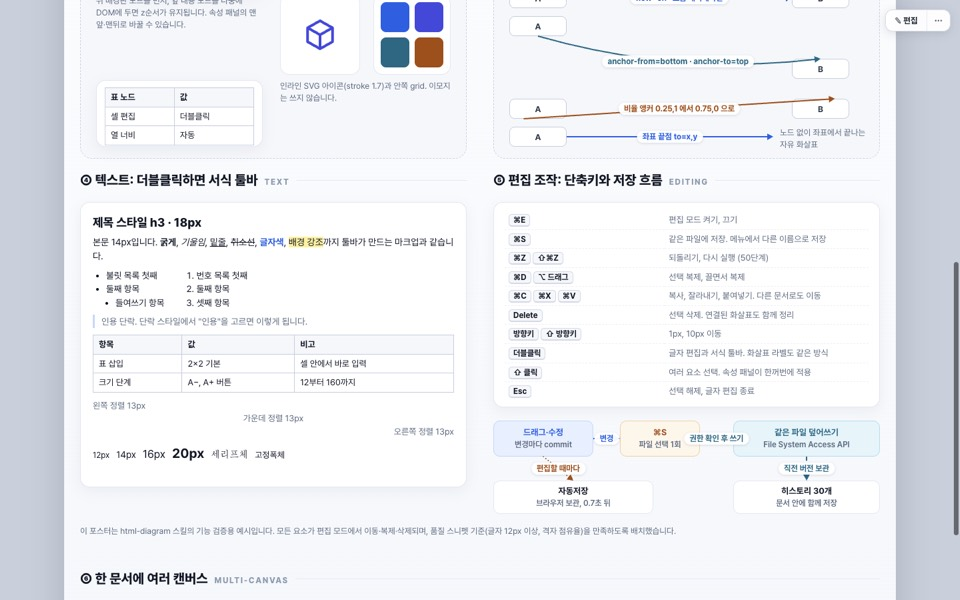
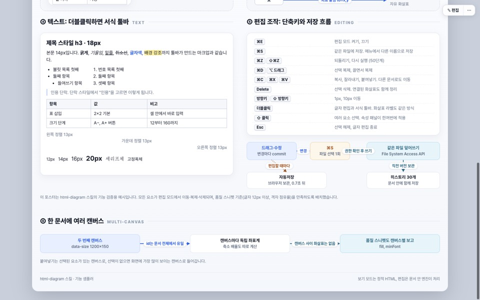

### Claude Opus 5

[poster.html](opus5/poster.html) · [report.md](opus5/report.md)

속성 하나당 타일 한 장에 포트 두 개로 보여 주는 구성이 가장 읽기 쉽다. 앵커 섹션의 허브 도식이 좋다. 다만 세 캔버스 모두 전폭 배경판을 깔아 격자 점유율 100%를 만든 점은 지표를 만족시킨 것이지 밀도가 높은 것은 아니다.

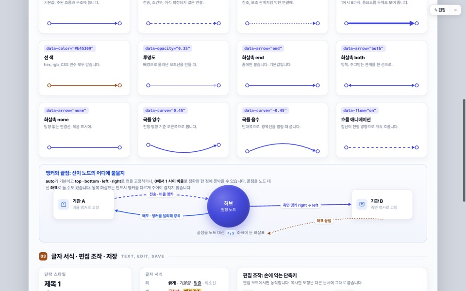
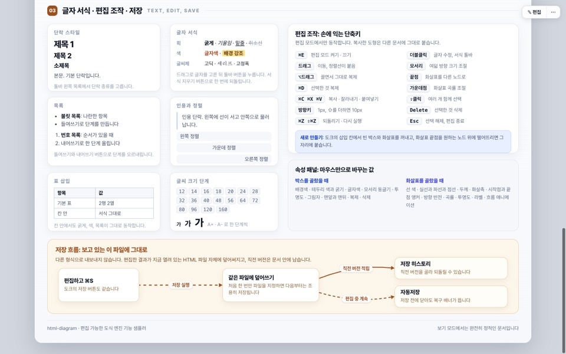

### Claude Sonnet 5

[poster.html](sonnet5/poster.html) · [report.md](sonnet5/report.md)

캔버스 4개, 노드 97개로 가장 방대하다. 속성마다 부채꼴 미니 도식으로 값 차이를 나란히 보여 주고, 곡률 부호 규칙을 문장으로 설명했다(이 과정에서 SKILL.md의 오기를 발견). 비율 앵커 시연의 설명 캡션이 화살표 라벨과 한 곳 겹친다.

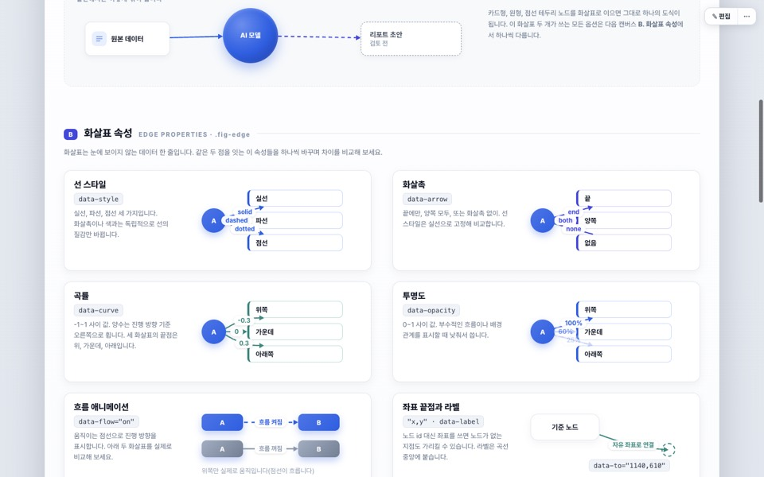

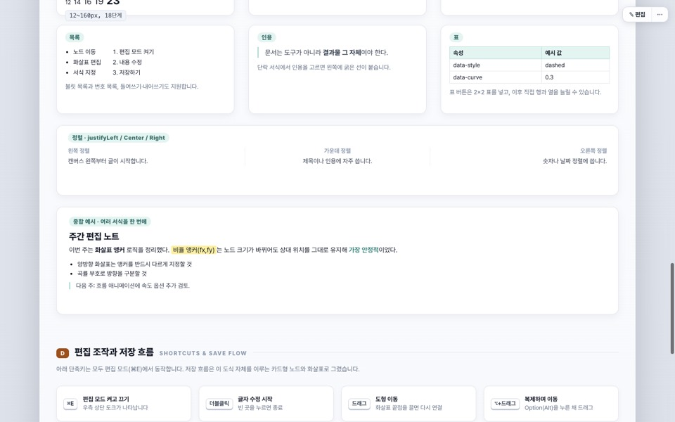
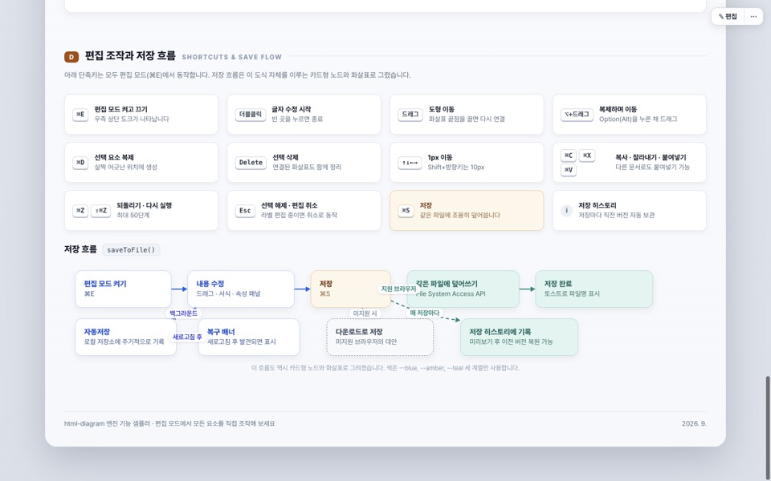

### GPT-5.6 luna

[poster.html](gpt56-luna/poster.html) · [report.md](gpt56-luna/report.md)

짙은 남색 헤더 밴드와 절제된 팔레트로 완성도가 높다. 섹션 02에서 선 표정·앵커·좌표 끝점을 세 열로 나눠 각각 실제 화살표로 보여 주며, 왕복 화살표를 다른 앵커와 같은 곡률로 정확히 분리했다. 두꺼운 선 위에 라벨이 얹혀 살짝 답답한 곳이 한 군데 있다.

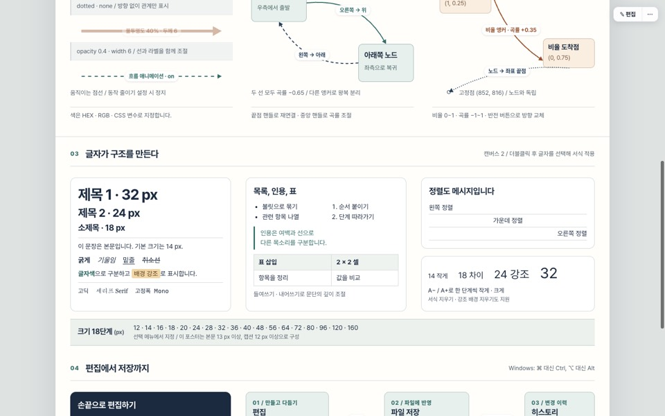
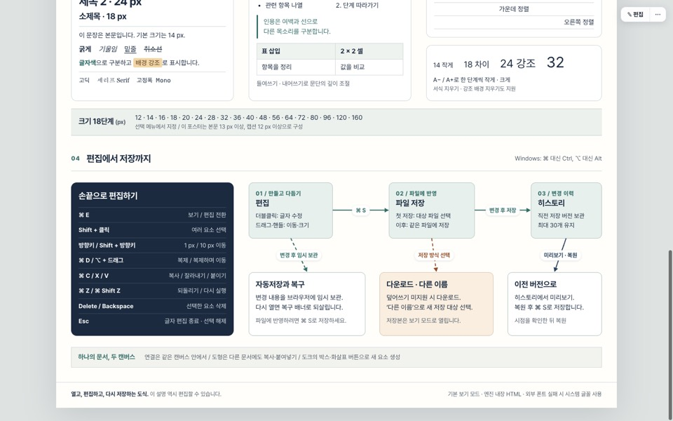

### GPT-5.6 terra

[poster.html](gpt56-terra/poster.html) · [report.md](gpt56-terra/report.md)

가장 성글다(노드 21). 배경판 한 장으로 점유율 100%. 카드 사이 짧은 화살표의 라벨이 인접 카드에 잘려 보이는 곳이 여러 군데다(선택 후 드래그, ⌘C ⌘V ⌘D, 변경 내용 직렬화).

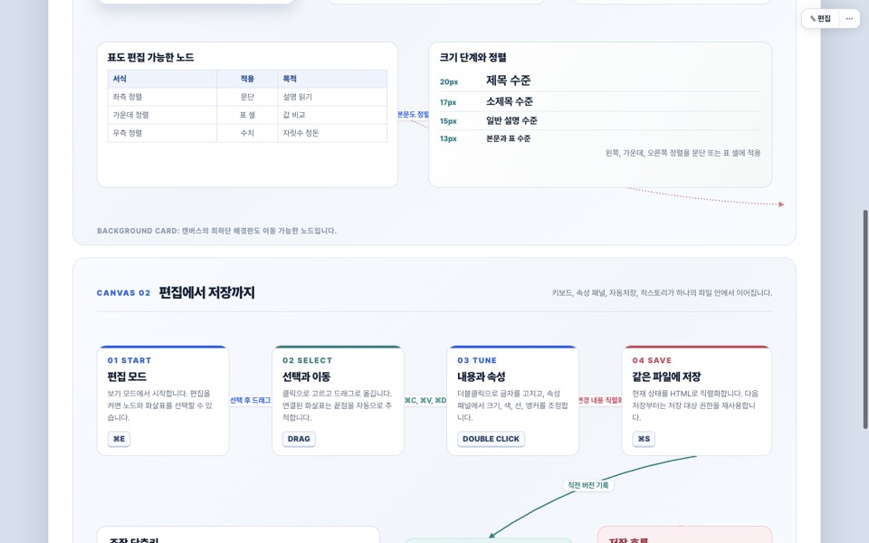
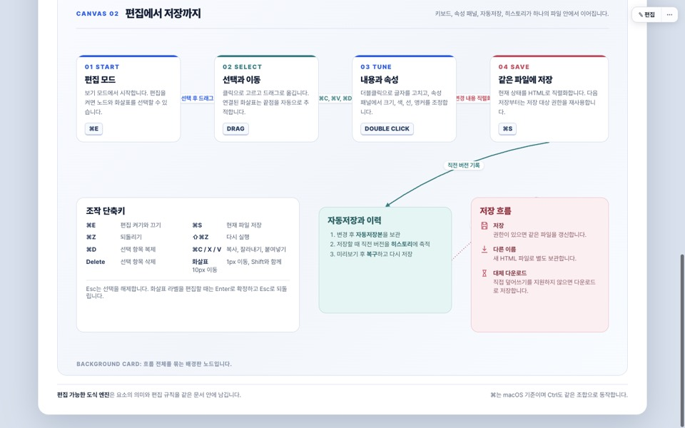

### GPT-5.6 sol

[poster.html](gpt56-sol/poster.html) · [report.md](gpt56-sol/report.md)

짙은 청록 편집 디자인 톤이 독자적이고 라벨 배치가 깔끔하다. 노드가 1인칭으로 자기를 설명하는 구성. 인라인 SVG 아이콘은 쓰지 않았다. 왕복 화살표의 곡률 규칙을 정확히 적었다.

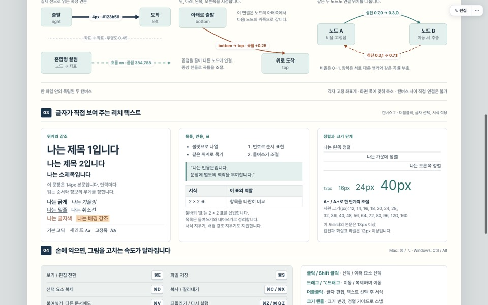
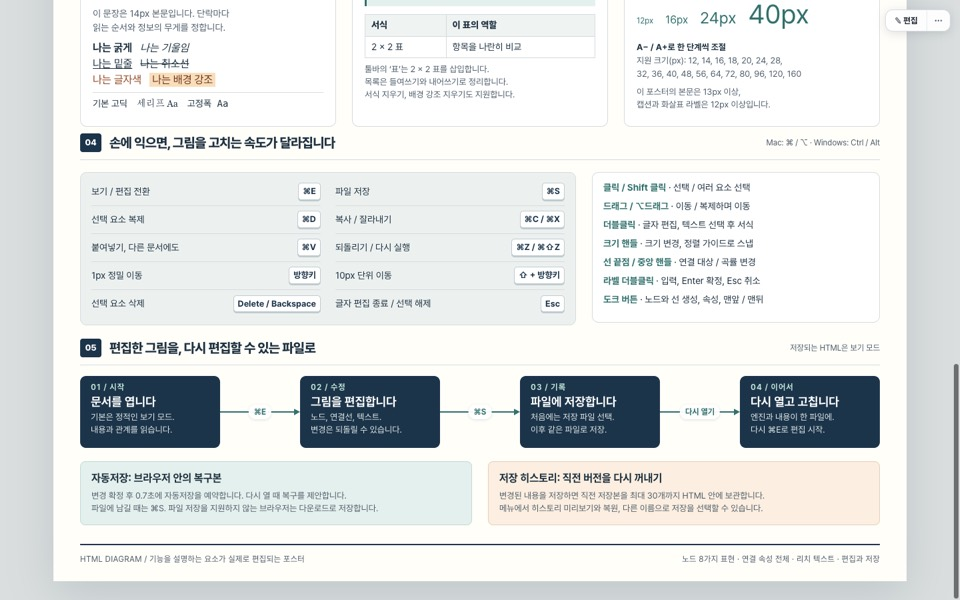

### GPT-5.6 astra

[poster.html](gpt56-astra/poster.html) · [report.md](gpt56-astra/report.md)

사용자가 Codex CLI로 xhigh에서 직접 실행. 캔버스 폭 1280을 택했고 속성마다 카드 안 미니 도식으로 보여 준다. 왕복 화살표를 서로 다른 비율 앵커와 같은 곡률로 정확히 분리했고, 곡률·앵커·좌표 끝점 카드가 특히 명확하다. 반투명 카드 뒤의 설명 글자 일부가 카드에 가려진다.

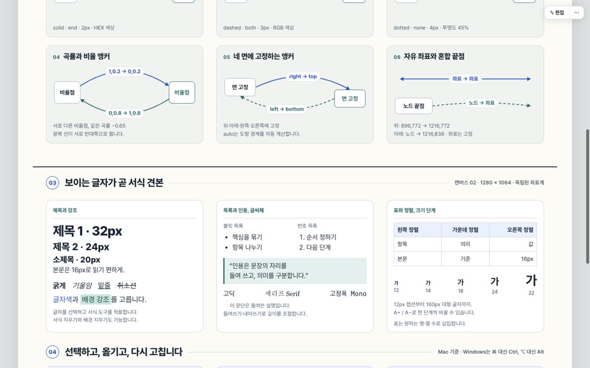
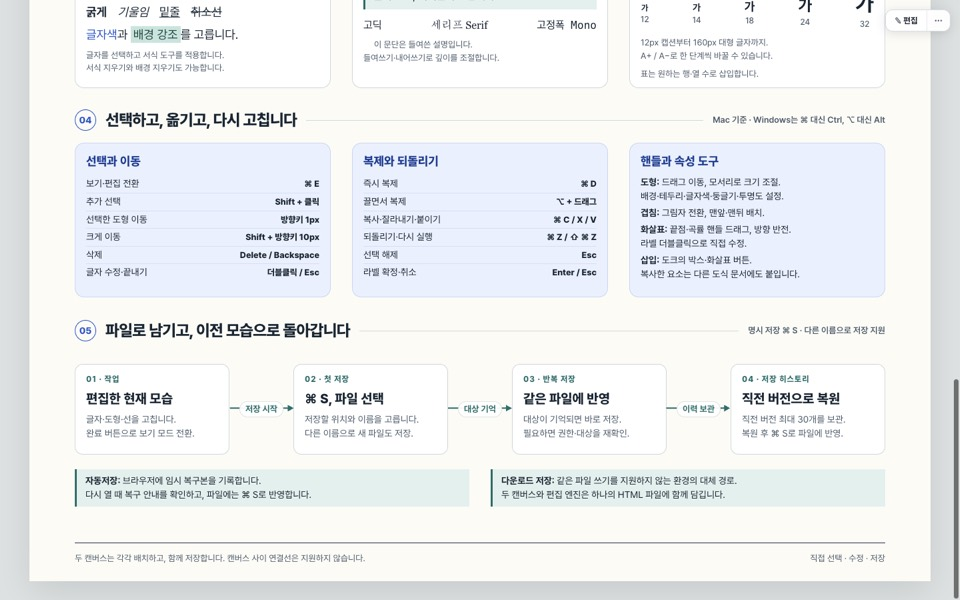
